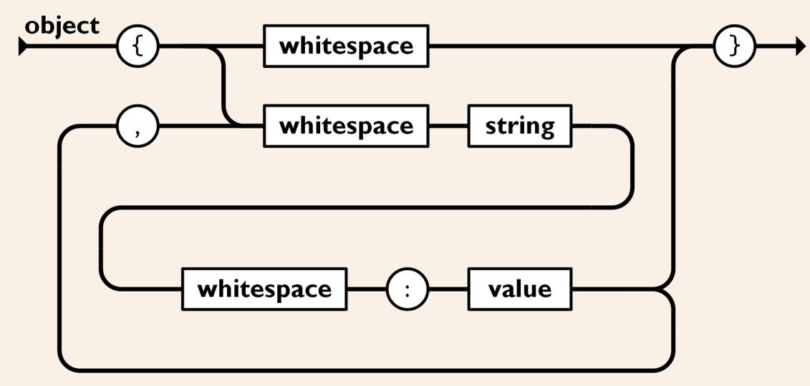
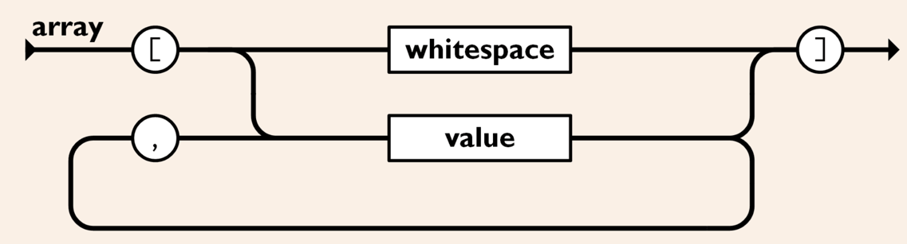
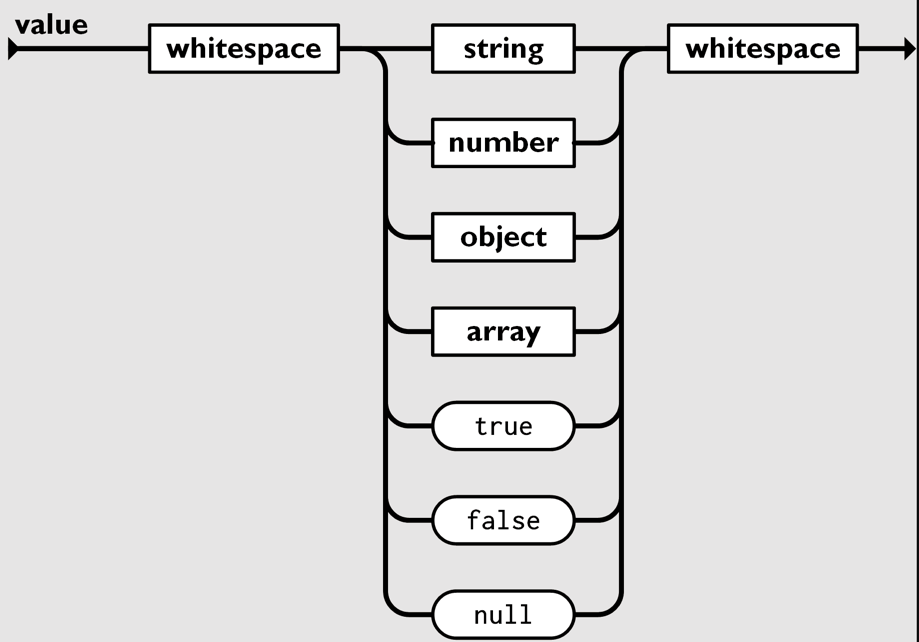

JSON validator
==============

*A simple JSON validator written in go*

### How to run the tests

Move inside the root directory of the project and run `go test` from the terminal

---

### How to use the tool

Move inside the root directory of the project and run the following command:

* `go run go-json [filename]` from the terminal

### Arguments

#### filename(mandatory):

* the name of the file to process, it can be a relative path or an absolute one

---

### Technical details

* The semantic definition of an object or array or value is compliant to the standard: https://www.json.org/json-en.html
    * 
    * 
    * 

* The semantic definition of the other types (e.g. whitespace, number, string) is not stricly compliant to the standard because of the lack of
  value from the learning point of view